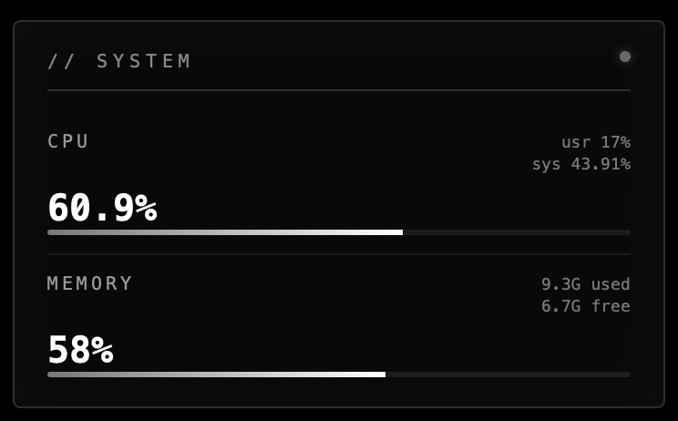
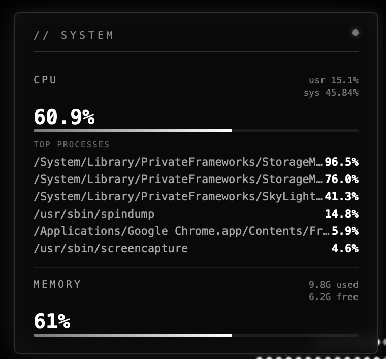
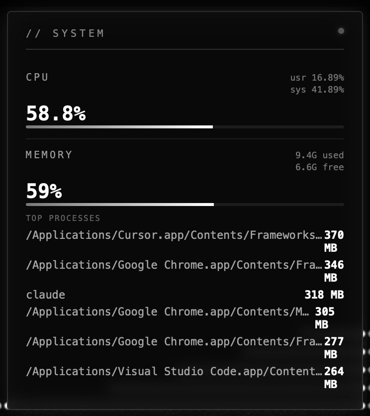

# System Widget

A minimal black/white/grey system monitor for Übersicht. Lives top-right
on your desktop. Hover a section to see its top processes.

## Install

1. Install [Übersicht](https://tracesof.net/uebersicht/) (free).
2. Menu bar icon → **Open widgets folder**.
3. Copy the `system-widget` folder in.
4. Menu bar icon → **Refresh**.

